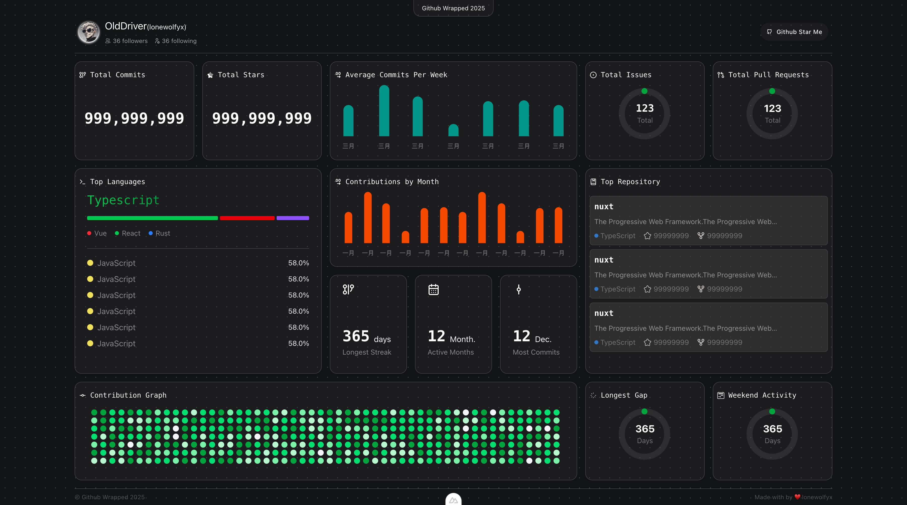

# GitHub Wrapped 2025

A beautiful GitHub annual statistics dashboard that presents your 2025 coding journey in an intuitive way.

### Key Features

- 📊 **Commit Statistics** - Total commits, average weekly commits, most active month, etc.
- ⭐ **Project Data** - Stars received, Pull Requests, Issues, etc.
- 🔥 **Contribution Streaks** - Longest contribution streak, longest gap, etc.
- 📈 **Language Analysis** - Most used programming languages ranking
- 📅 **Contribution Charts** - Monthly and detailed contribution heatmaps
- 💻 **Repository Rankings** - Most active repositories display

## License

MIT License - See the [LICENSE](LICENSE) file for details.
